<h1 align="center">「오늘 뭐 먹지? - AI Lunch Curator」</h1>

<p align="center"><b>광명융합기술교육원 5조</b></p>

<p align="center">
  
  
  
  
  
  
  
  
  
</p>

> 광명융합기술교육원(KOPO) 구내식당 식단표를 매주 수집해서, OpenAI로 메뉴를 분석·시각화하고 Oracle에 쌓은 뒤,
> 평일 아침마다 Teams로 "오늘의 점심"을 보내는 자동화 파이프라인입니다. 웹에서는 오늘·이력·통계를 볼 수 있습니다.

<details>
<summary><b>📋 과제 브리프 보기 (담당 교수님 공지)</b></summary>
<br>

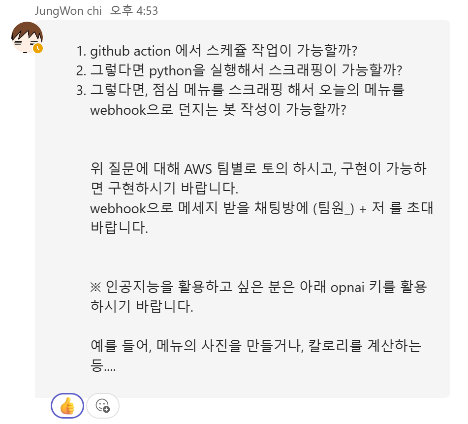

> 과제는 **① GitHub Actions로 스케줄 작업이 가능한가 → ② Python으로 스크래핑이 가능한가 → ③ 점심 메뉴를 스크래핑해 오늘 메뉴를 webhook으로 던지는 봇을 만들 수 있는가**, 이 세 질문을 팀별로 토의하고 구현하는 것이었습니다. 이 저장소는 세 가지를 모두 구현하고, 거기에 OpenAI 분석·이미지·웹·DB·배포를 더한 결과입니다.

</details>

> **감사의 글** — 이번 팀 과제에서 **OpenAI API 키를 제공해 주신 교수님께 감사드립니다.** 덕분에 메뉴 분석과 대표 이미지 생성까지 실제로 붙여볼 수 있었습니다. 제공받은 키가 공개 저장소에 노출되지 않도록 [10. 보안 · 비밀값 관리](#10-보안--비밀값-관리)의 조치를 적용했습니다.

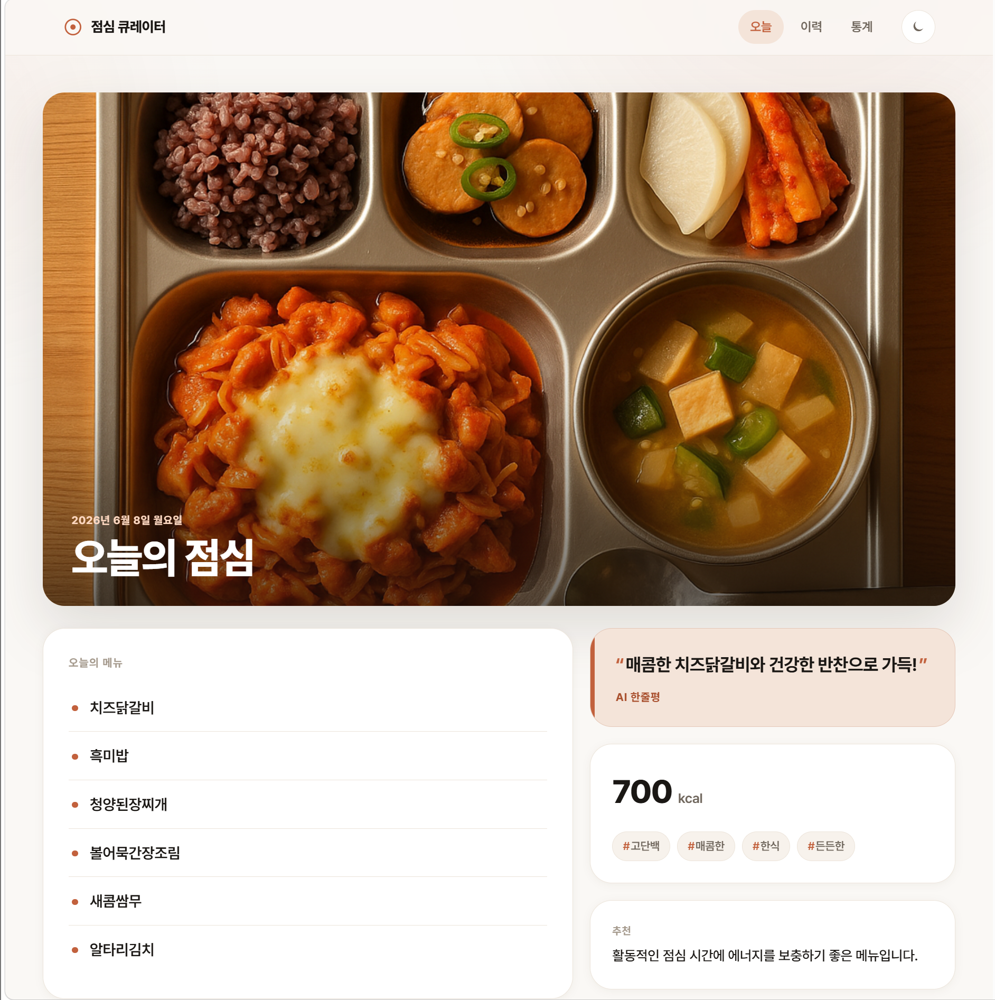

<details open>
<summary><b>목차</b></summary>
<br>

* [1. 프로젝트 개요](#1-프로젝트-개요)
* [2. 팀 — 5조](#2-팀--5조)
* [3. 화면](#3-화면)
* [4. 코어 봇 · 테스트](#4-코어-봇--테스트)
* [5. 아키텍처 · 데이터 모델](#5-아키텍처--데이터-모델)
* [6. 데이터 — Oracle](#6-데이터--oracle)
* [7. GitHub Actions — 스케줄 · CI/CD](#7-github-actions--스케줄--cicd)
* [8. 배포 — EC2 · Nginx](#8-배포--ec2--nginx)
* [9. Teams 발송](#9-teams-발송)
* [10. 보안 · 비밀값 관리](#10-보안--비밀값-관리)
* [11. 트러블슈팅](#11-트러블슈팅)
* [12. 한계와 개선점 · 실무 확장](#12-한계와-개선점--실무-확장)
* [13. 디렉터리 구조 · 실행](#13-디렉터리-구조--실행)

</details>

---

## 1. 프로젝트 개요

매주 월요일 아침 GitHub Actions가 수집 엔드포인트를 호출하면, 앱이 학교 식단표를 크롤링하고 OpenAI로 메뉴를
분석(한줄평·칼로리·태그·추천)하고 대표 이미지를 만들어 Oracle에 저장합니다. 평일 아침엔 발송 엔드포인트가 그날 메뉴를
Teams로 보냅니다. 같은 메뉴 이미지는 해시 키로 캐시해 다시 만들지 않고, 무거운 작업은 백그라운드로 돌려 트리거는 즉시 응답합니다.

과제 브리프의 세 질문(스케줄·스크래핑·webhook 봇)을 그대로 만족시키면서, 외부 API를 부르는 트리거는 토큰으로 막아
비용·악용을 차단하는 데 신경 썼습니다.

### 기술 스택

| 분류 | 기술 | 용도 |
| :--- | :--- | :--- |
| **Web** | FastAPI · Jinja2 · uvicorn | 페이지(오늘/이력/통계) · JSON API · 토큰 보호 트리거 |
| **수집** | Python · BeautifulSoup4 | 식단표 크롤링 (실패 시 샘플 폴백) |
| **AI** | OpenAI (텍스트 · 이미지) | 메뉴 분석 + 대표 이미지 생성 |
| **DB** | Oracle XE · python-oracledb(thin) | MERGE UPSERT · 이미지 캐시 · 통계 집계 |
| **알림** | Teams Workflows 웹훅 | Adaptive Card 발송 |
| **인프라** | Docker Compose · AWS EC2 · Nginx | 컨테이너 배포 · 리버스 프록시 |
| **CI/CD** | GitHub Actions | pytest 게이트 · 스케줄 트리거 · 배포 |

---

## 2. 팀 — 5조

| 멤버 | 역할 | 주요 기여 |
| :---: | :--- | :--- |
| <a href="https://github.com/SanghyeokLee-KR"></a><br>**[이상혁](https://github.com/SanghyeokLee-KR)**<br>*(조장)* | 아키텍처 · 인프라 총괄 | 전체 설계, **웹(FastAPI)·DB(Oracle)·이미지 생성**, Docker/EC2/Nginx 배포, GitHub Actions CI/CD, 통합·문서 |
| <a href="https://github.com/nohhyunju0212"></a><br>**[노현주](https://github.com/nohhyunju0212)** | 메뉴 AI 분석 | 메뉴 데이터를 받아 **OpenAI로 요약·추천·멘트 생성** (한줄평·예상 칼로리·태그·추천 프롬프트 설계) |
| <a href="https://github.com/adieud99"></a><br>**[김연동](https://github.com/adieud99)** | 크롤링 · 알림 | **파이썬 크롤링**으로 오늘 급식 점심 메뉴 수집, **Teams Webhook 발송** 연동 |

---

## 3. 화면

Pretendard · 따뜻한 오프화이트 + 테라코타 톤. 디자인 토큰을 CSS 변수로 잡고 라이트/다크 모드를 지원합니다.

<table align="center">
<tr>
<td align="center" width="33%"><br><b>오늘의 점심</b><br><sub>생성 이미지 히어로 + AI 한줄평·칼로리·태그</sub></td>
<td align="center" width="33%">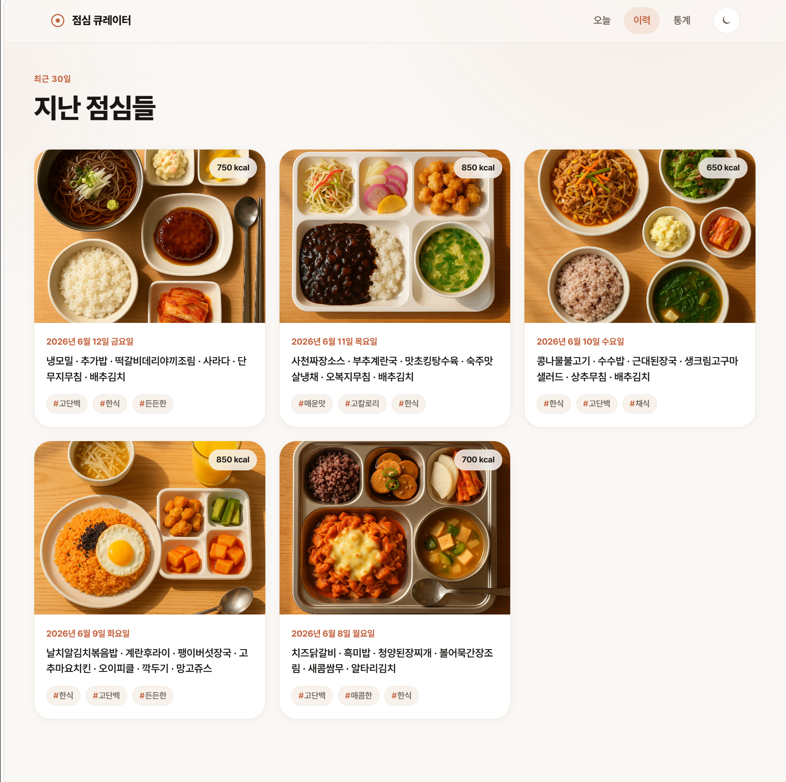<br><b>지난 점심 (30일)</b><br><sub>썸네일 카드 그리드</sub></td>
<td align="center" width="33%">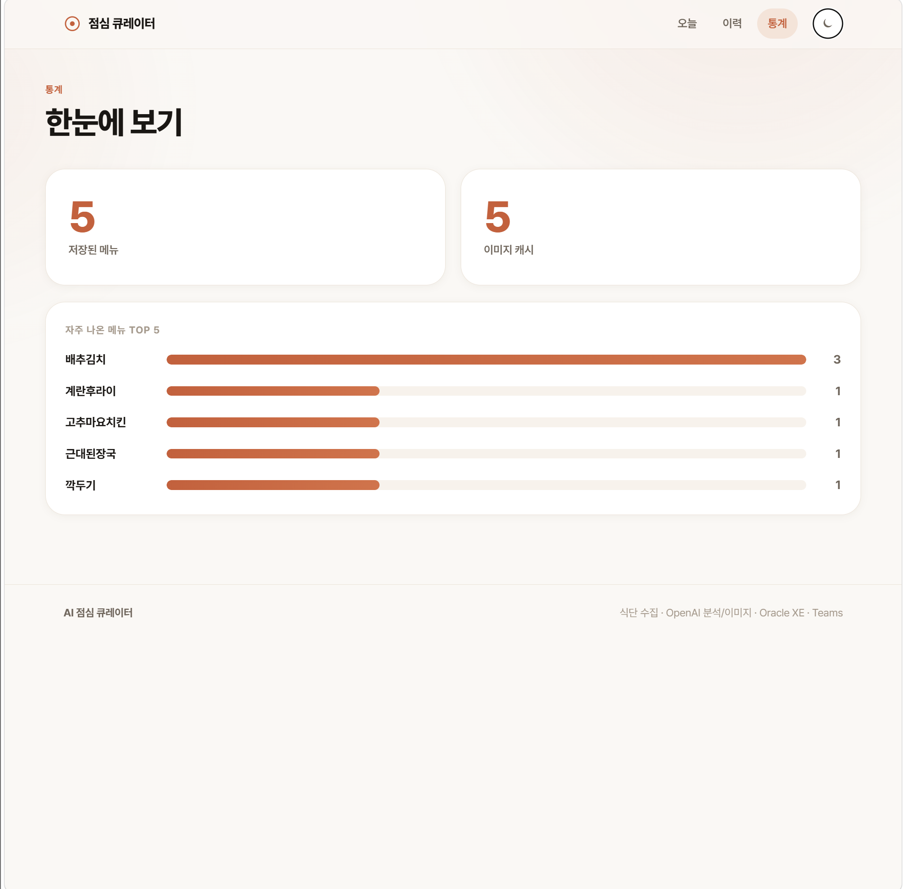<br><b>통계</b><br><sub>자주 나온 메뉴 TOP5</sub></td>
</tr>
</table>

<details>
<summary>다크 모드</summary>
<table align="center">
<tr>
<td align="center" width="33%">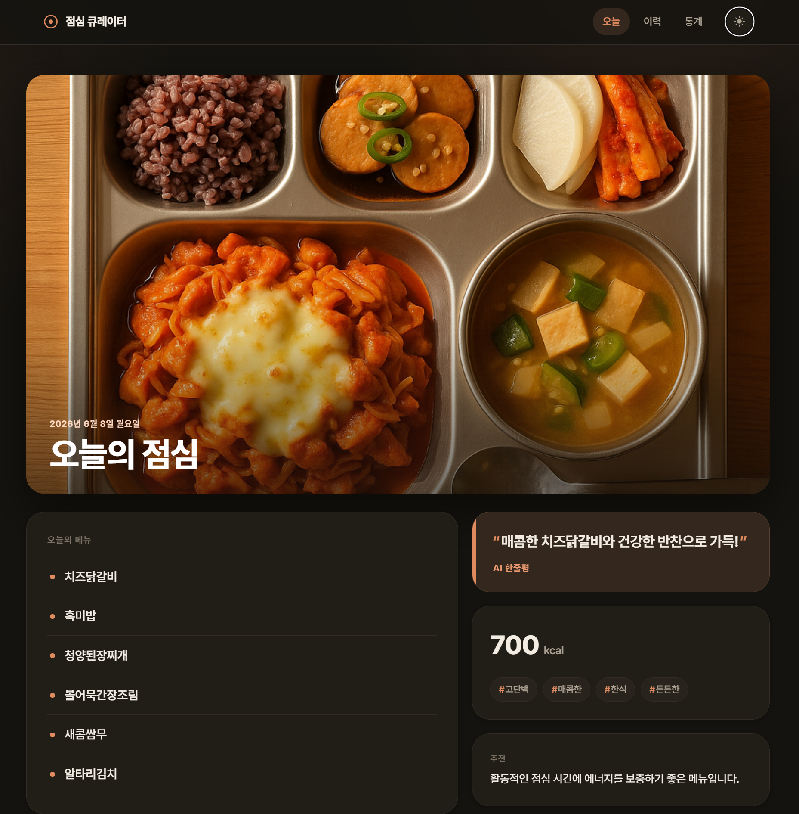</td>
<td align="center" width="33%">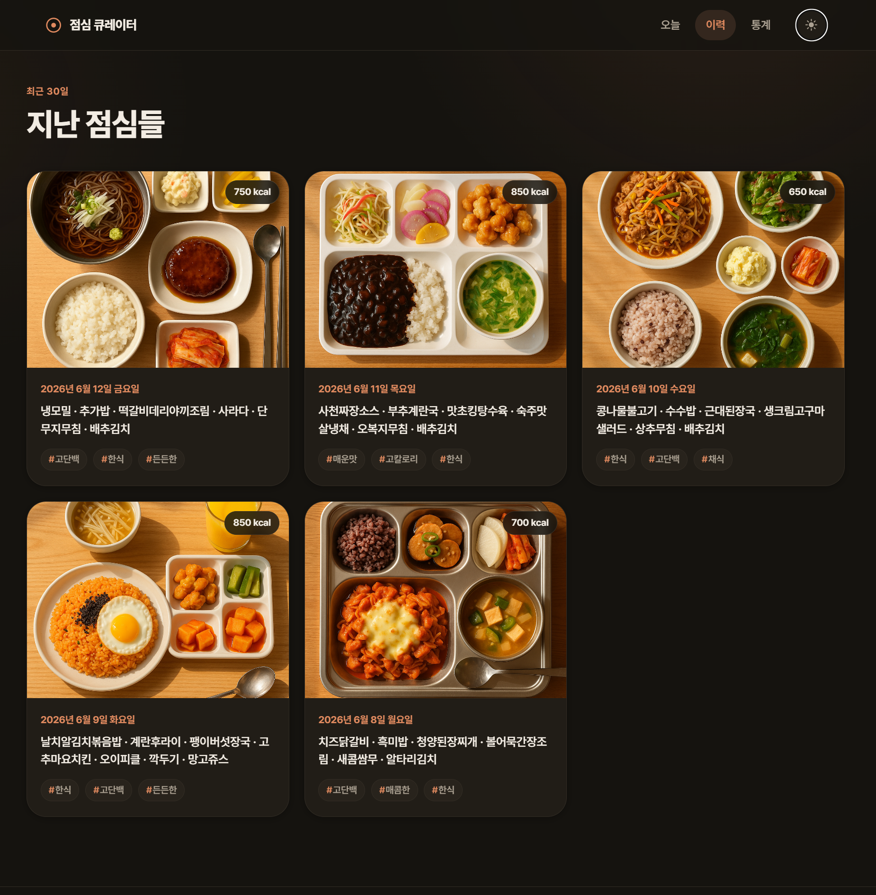</td>
<td align="center" width="33%">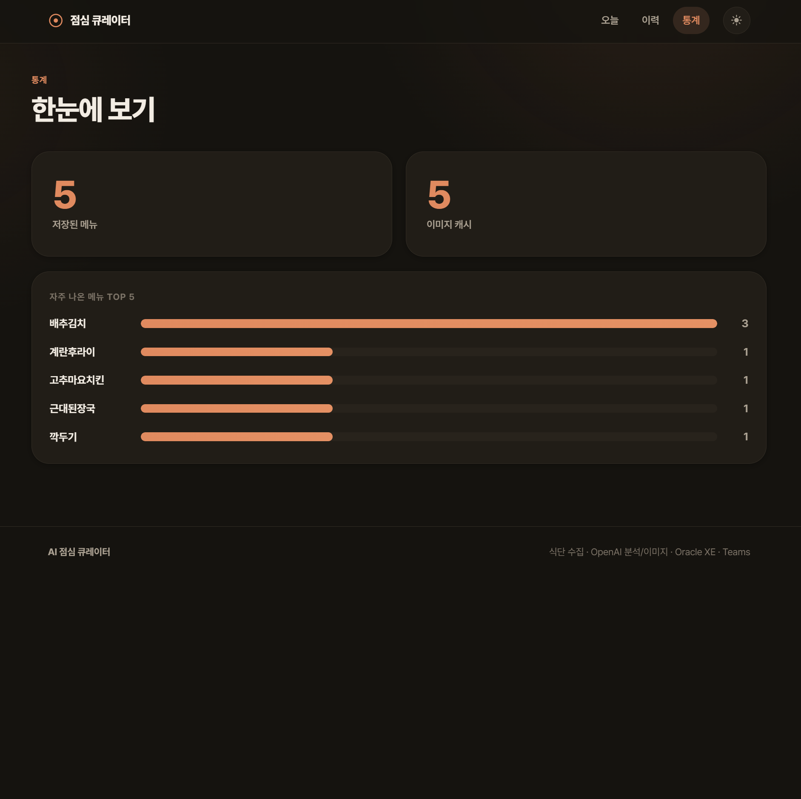</td>
</tr>
</table>
</details>

---

## 4. 코어 봇 · 테스트

웹 없이 GitHub Actions만으로도 돌 수 있게, 수집→분석→이미지→발송을 CLI 하나(`app/run_bot.py`)로도 만들었습니다.

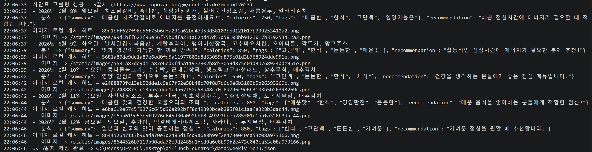

테스트는 **외부 호출(OpenAI·Teams)을 전부 목킹**해서 실제로는 한 번도 부르지 않습니다. 요금·스팸이 새지 않게 하려는 의도입니다.

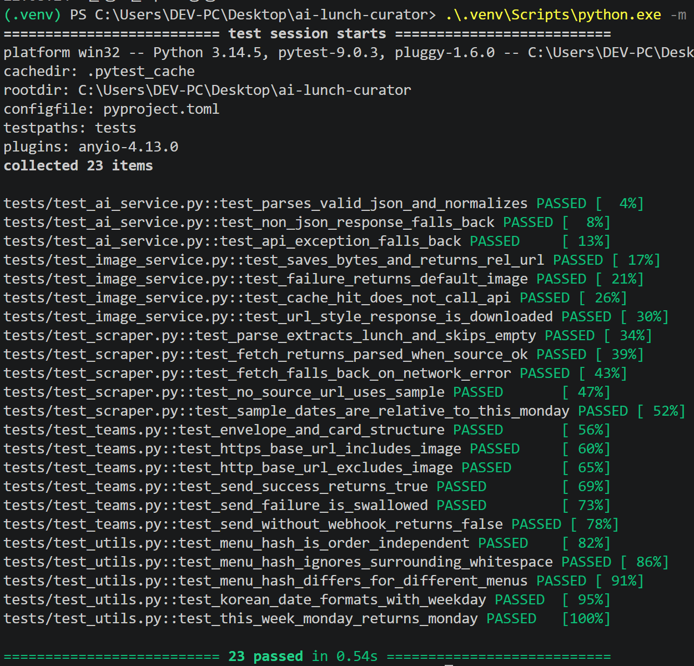

---

## 5. 아키텍처 · 데이터 모델

### 배포 아키텍처

외부에는 **Nginx(:80)만 공개**하고 앱(:8000)은 `127.0.0.1`로만 바인드해 직접 접근을 막았습니다. 수집·발송 트리거는
GitHub Actions가 cron으로 호출하고, 앱은 KOPO 식단표·OpenAI·Teams 세 곳과만 외부 통신합니다.

<p align="center">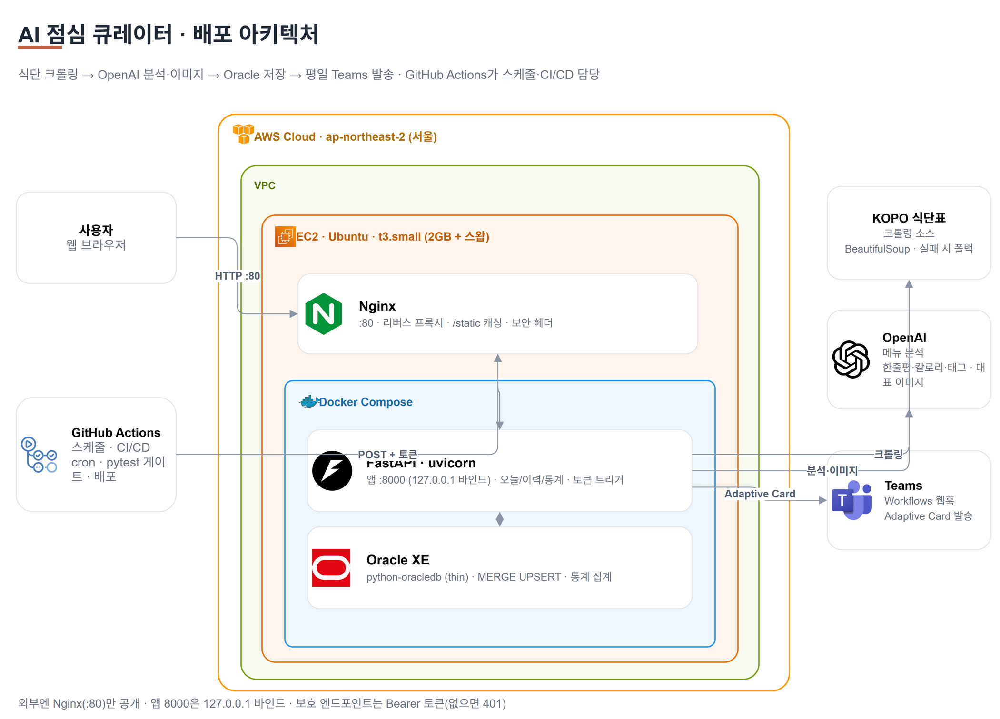</p>

### 데이터 모델 (ERD)

메뉴 JSON을 한 컬럼에 묶어두지 않고, 통계를 위해 `MENU_ITEM`으로 정규화했습니다. 이미지는 `MENU_IMAGE_CACHE`에
해시 키로 따로 저장해 같은 메뉴 구성이면 재사용합니다.

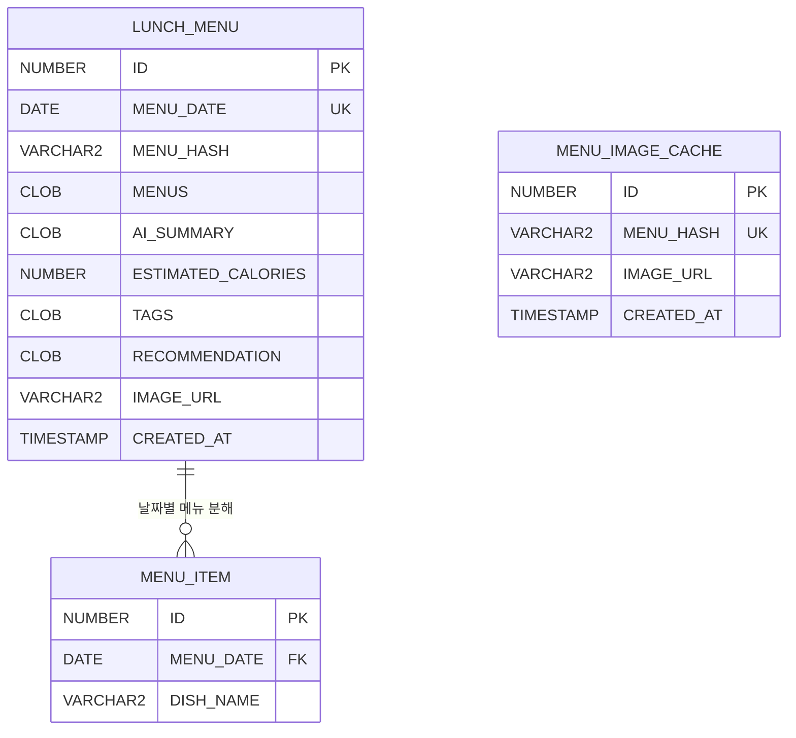
```mermaid
erDiagram
    LUNCH_MENU ||--o{ MENU_ITEM : "날짜별 메뉴 분해"
    LUNCH_MENU {
        NUMBER ID PK
        DATE MENU_DATE UK
        VARCHAR2 MENU_HASH
        CLOB MENUS
        CLOB AI_SUMMARY
        NUMBER ESTIMATED_CALORIES
        CLOB TAGS
        CLOB RECOMMENDATION
        VARCHAR2 IMAGE_URL
        TIMESTAMP CREATED_AT
    }
    MENU_ITEM {
        NUMBER ID PK
        DATE MENU_DATE FK
        VARCHAR2 DISH_NAME
    }
    MENU_IMAGE_CACHE {
        NUMBER ID PK
        VARCHAR2 MENU_HASH UK
        VARCHAR2 IMAGE_URL
        TIMESTAMP CREATED_AT
    }
```

> `MENU_IMAGE_CACHE`는 `MENU_HASH`로 `LUNCH_MENU`와 논리적으로 연결됩니다(물리 FK는 아님). 저장은 `MENU_DATE` 기준 MERGE라 같은 날 다시 돌려도 UNIQUE 충돌 없이 갱신됩니다.

### 수집 · 발송 시퀀스

<p align="center">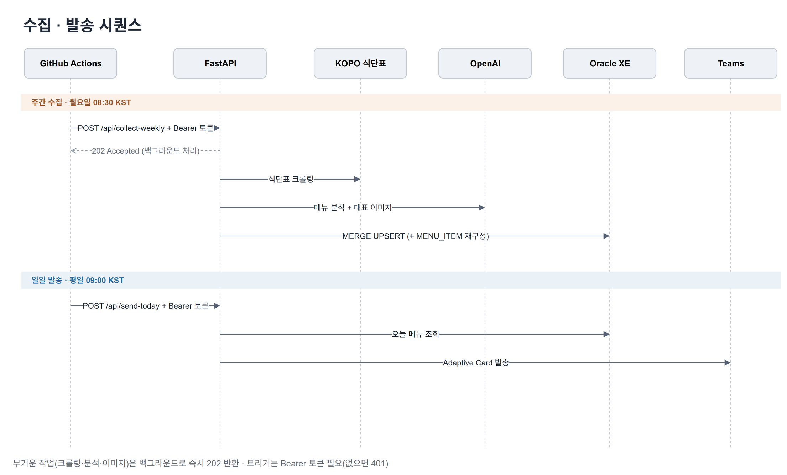</p>

> 이 문서의 draw.io 다이어그램 원본(`.drawio`)은 모두 [`diagrams/src/`](diagrams/src)에 있어 그대로 열어 편집할 수 있습니다. PNG는 `diagrams/png/`로 내보낸 것입니다.

---

## 6. 데이터 — Oracle

`LUNCH_MENU`(날짜별 메뉴·분석), `MENU_IMAGE_CACHE`(해시→이미지), 통계용 `MENU_ITEM`으로 나눴습니다.
"자주 나온 메뉴"는 `MENU_ITEM`을 `GROUP BY`로 집계합니다.

<table align="center">
<tr>
<td align="center" width="50%">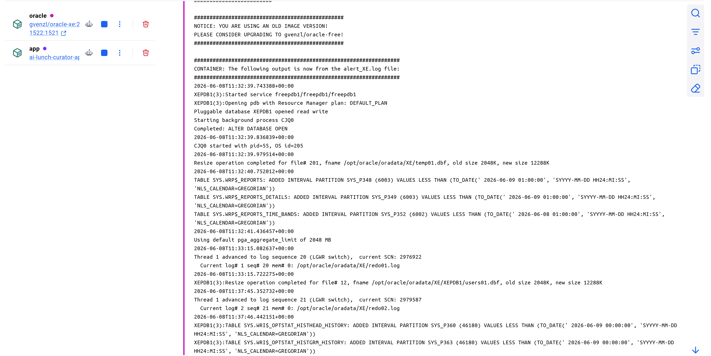<br><b>Docker 위 Oracle XE</b></td>
<td align="center" width="50%">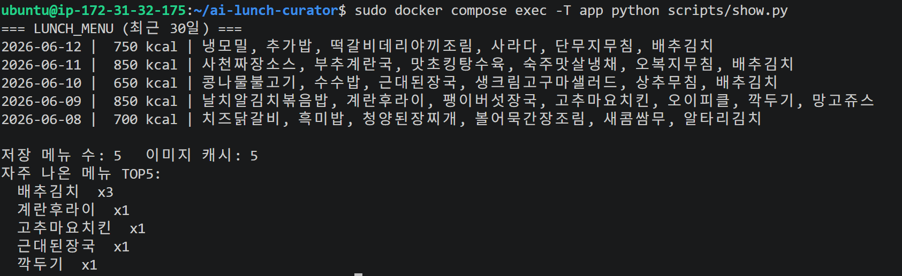<br><b>적재 데이터 조회</b></td>
</tr>
</table>

---

## 7. GitHub Actions — 스케줄 · CI/CD

| 워크플로 | 트리거 | 하는 일 |
|---|---|---|
| `ci.yml` | push / PR | `pytest` (목킹이라 시크릿 불필요) |
| `weekly-menu.yml` | 월 08:30 KST + 수동 | 수집 엔드포인트 호출 (Bearer 토큰) |
| `daily-notify.yml` | 평일 09:00 KST + 수동 | 발송 엔드포인트 호출 |
| `deploy.yml` | main push | **테스트 통과를 선행 조건**으로 EC2 SSH 배포 |

> GitHub Actions 스케줄은 정시 보장이 안 되고(수 분~수십 분 지연), 레포가 60일 비활성이면 자동 비활성화됩니다.

<p align="center">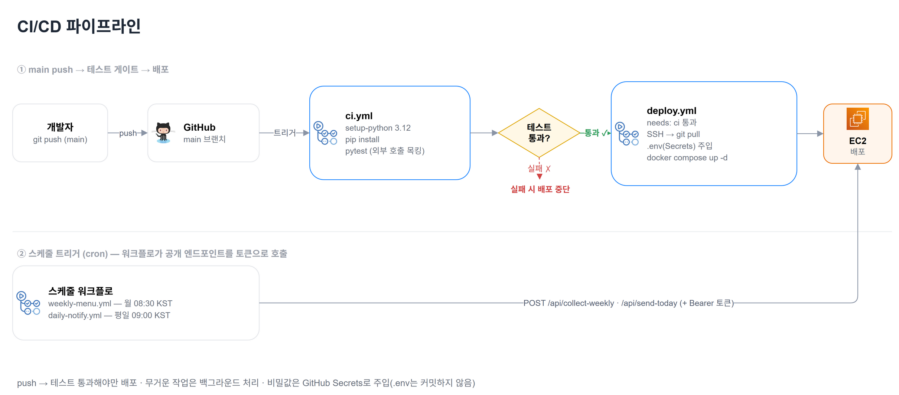</p>

<table align="center">
<tr>
<td align="center" width="50%">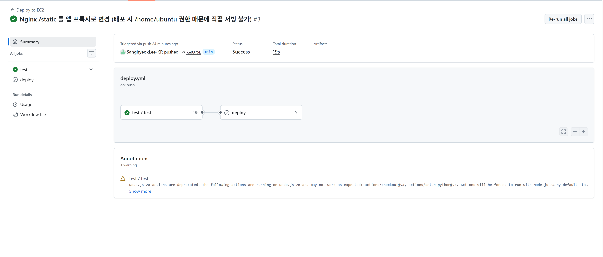<br><b>CI — pytest 통과</b></td>
<td align="center" width="50%">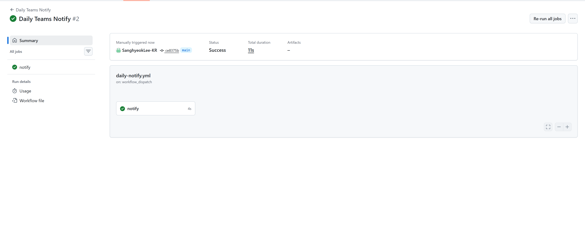<br><b>스케줄 워크플로 · 수동 실행 성공</b></td>
</tr>
</table>

---

## 8. 배포 — EC2 · Nginx

EC2(Ubuntu, t3.small + 스왑)에 `docker compose`로 올리고, 외부엔 Nginx(80)만 노출합니다. 앱(8000)은 `127.0.0.1`로만
바인드하고 보안 그룹은 22·80만 열어, 8000·1521 같은 내부 포트는 밖에서 닿지 않습니다.

<p align="center">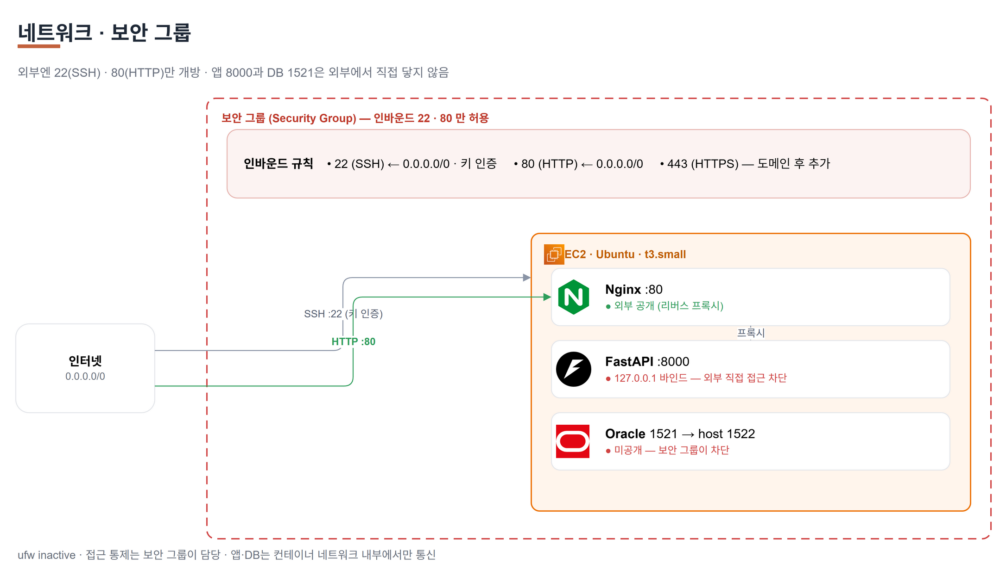</p>

<table align="center">
<tr>
<td align="center" width="50%">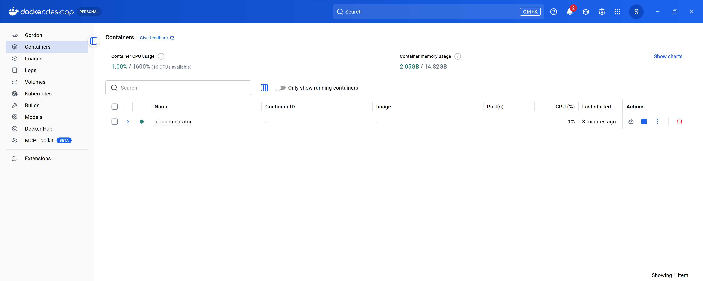<br><b>로컬 — Docker Compose</b></td>
<td align="center" width="50%">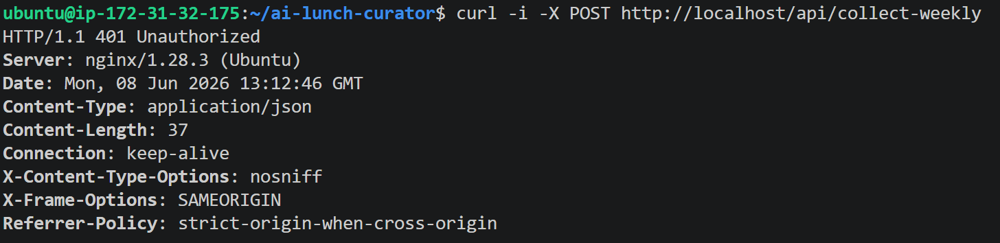<br><b>토큰 없는 호출 → 401</b></td>
</tr>
</table>

> 지금은 도메인이 없어 HTTP로 서비스 중입니다. 도메인을 붙이면 `certbot --nginx`로 HTTPS까지 가게 설정 파일은 `deploy/nginx/`에 둬뒀습니다.

---

## 9. Teams 발송

Teams **Workflows**의 "웹후크 경고 보내기"로 받은 URL을 씁니다. 페이로드는 message 봉투 + Adaptive Card 형식입니다.

<p align="center">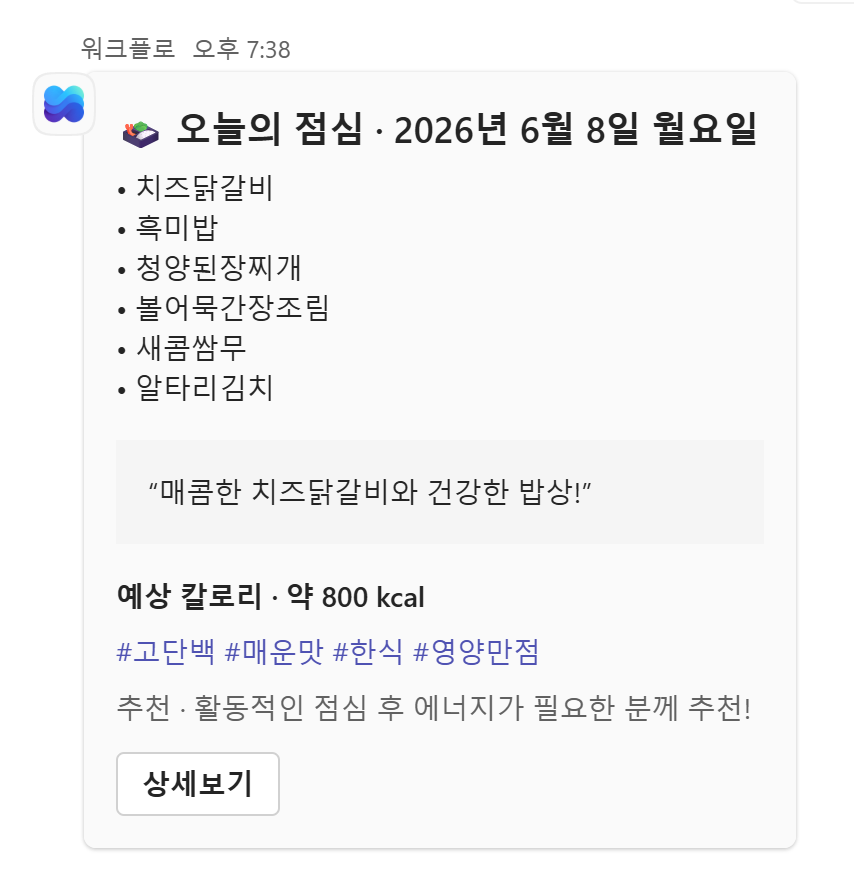</p>

> 카드 안 이미지는 HTTPS URL만 렌더되므로, `APP_BASE_URL`이 http면 이미지 없이 텍스트 + 상세보기 링크로 보냅니다.

---

## 10. 보안 · 비밀값 관리

교수님이 제공해 주신 **OpenAI API 키**와 **Teams 웹훅 URL**은 공개 저장소에 절대 노출되면 안 되는 값입니다.
키가 새면 요금이 청구되거나 임의의 메시지가 채널로 나갈 수 있어서, 다음을 적용했습니다.

| 막은 것 | 어떻게 |
|---|---|
| **키·웹훅이 깃에 올라가는 것** | `.env`를 `.gitignore`로 추적 제외.<br>코드엔 `os.getenv`로만 읽고 값은 하드코딩하지 않음 |
| **실수로 커밋되는 것** | 저장소 공개 전 `git grep`으로 키·웹훅·비밀번호 패턴 스캔<br>(추적 파일에 평문 0건 확인) |
| **CI·배포에서 노출되는 것** | GitHub Secrets로만 주입.<br>배포 시 `.env`를 Secrets로 EC2에 생성(로그엔 마스킹) |
| **아무나 트리거를 부르는 것** | 수집·발송 엔드포인트에 **Bearer 토큰** 게이트 → 없으면 **401**.<br>키를 쓰는 비싼 작업을 외부에서 못 부름 |
| **앱 포트 직접 노출** | 앱 `:8000`은 `127.0.0.1` 바인드 + 보안 그룹 22·80만.<br>외부엔 Nginx(:80)만 |

> 노출 위험이 있던 키는 작업 후 폐기·재발급하는 것을 원칙으로 합니다. (`.env.example`에는 형식만 두고 실제 값은 넣지 않습니다.)

---

## 11. 트러블슈팅

배포까지 가면서 실제로 막혔던 것들과 해결입니다.

- **WSL2가 깨져 Docker 엔진이 안 떴습니다** (`Wsl/CallMsi/Install/REGDB_E_CLASSNOTREG`). 기능 활성화 + 재부팅으로도 안 풀려서, 공식 WSL MSI를 직접 받아 설치해 복구했습니다.
- **t3.micro(1GB)로 떠서 Oracle XE가 안 올라갔습니다.** 인스턴스 유형을 t3.small(2GB)로 바꾸고 스왑 2GB를 잡았습니다.
- **루트 디스크 8GB가 부족**(Oracle 이미지만 ~2.5GB)했습니다. EBS 볼륨을 30GB로 늘렸습니다.
- **호스트 1521 포트를 이미 쓰던 다른 Oracle이 점유**하고 있어서, 컨테이너는 1522로 비켜 매핑했습니다.
- **Nginx가 `/static`을 호스트 파일에서 직접 못 읽었습니다**(`/home/ubuntu` 권한). 정적 파일을 앱으로 프록시하도록 바꿔 해결했습니다.

<table align="center">
<tr>
<td align="center" width="50%">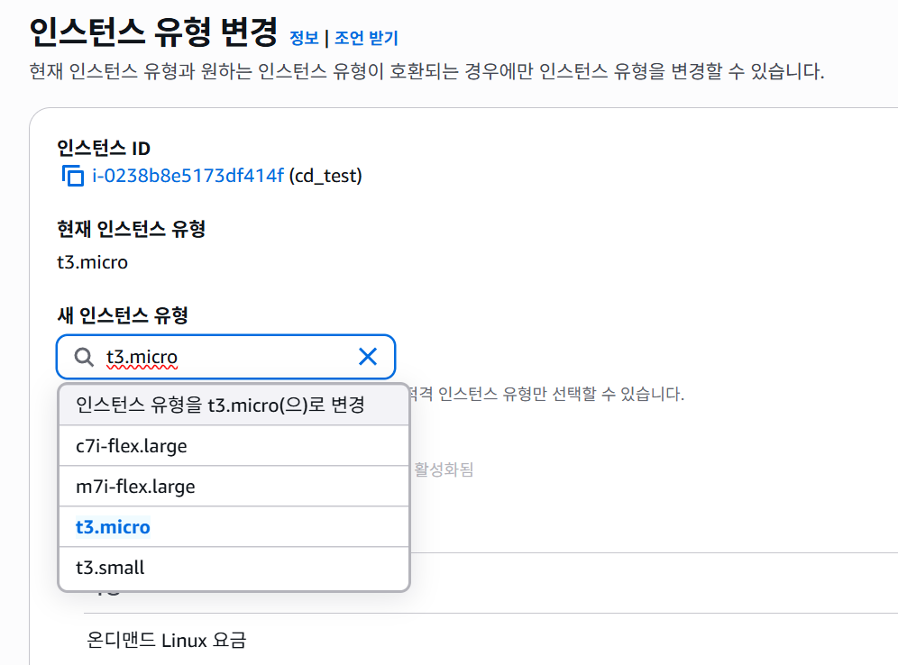<br><b>인스턴스 유형 변경 (micro → small)</b></td>
<td align="center" width="50%">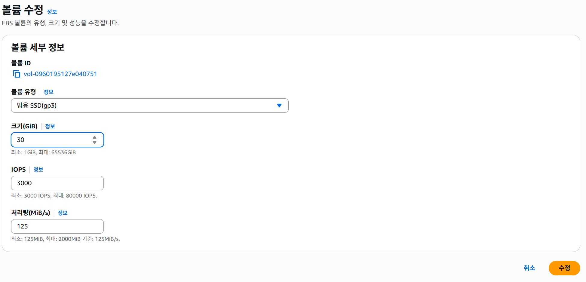<br><b>EBS 볼륨 확장 (8 → 30GB)</b></td>
</tr>
</table>

---

## 12. 한계와 개선점 · 실무 확장

**한계**

- 크롤링이 식단표 페이지 구조에 묶여 있습니다. 소스가 바뀌면 깨집니다(파서만 교체 가능하게 분리는 해 뒀습니다).
- 이미지 캐시는 "같은 메뉴 구성"일 때만 히트해서, 메뉴가 매일 달라 실제 히트율은 낮습니다.
- 도메인이 없어 HTTP만 서비스 중이라, 현재는 Teams 카드에 이미지가 안 붙습니다.
- 단일 EC2라 인스턴스가 죽으면 서비스도 멈춥니다.

**실무로 간다면**

- **HTTPS + 도메인** — `certbot`으로 TLS, 그러면 카드 이미지까지 렌더됩니다.
- **이미지 빌드 → 레지스트리(GHCR) → EC2는 pull만**, 또는 ASG + Launch Template으로 교체형 배포.
- **RDS** 같은 관리형 DB로 백업·가용성 위임.
- 크롤링 실패·구조 변경을 알림으로 잡고, 공식 API가 있으면 교체.

---

## 13. 디렉터리 구조 · 실행

```
ai-lunch-curator/
├── app/                  # FastAPI 웹 + 코어 봇
│   ├── main.py · scraper.py · ai_service.py · image_service.py
│   ├── teams.py · db.py · run_bot.py
│   ├── templates/        #   Jinja2 (오늘/이력/통계)
│   └── static/           #   CSS · JS · favicon
├── sql/schema.sql        # Oracle 스키마
├── scripts/              # seed · show
├── tests/                # pytest (외부 호출 목킹)
├── .github/workflows/    # ci · weekly · daily · deploy
├── deploy/nginx/         # Nginx 리버스 프록시 설정
├── docs/                 # 아키텍처(svg) · 스크린샷
├── docker-compose.yml · Dockerfile
└── README.md
```

**로컬 실행**

```bash
cp .env.example .env                 # 키·DB 비밀번호 등 채우기
docker compose up -d --build
docker compose exec app python scripts/seed.py   # 데이터 적재
# http://localhost:8000
```

**환경변수** — `.env`(로컬) / GitHub Secrets(CI·배포)로만 두고 깃에는 올리지 않습니다.

| 키 | 설명 |
|---|---|
| `OPENAI_API_KEY` / `OPENAI_TEXT_MODEL` / `OPENAI_IMAGE_MODEL` | OpenAI 키 · 모델 |
| `WEBHOOK_URL` | Teams Workflows 웹훅 |
| `APP_BASE_URL` | 공개 주소 (https여야 카드 이미지 렌더) |
| `MENU_SOURCE_URL` | 식단표 소스 (비우면 샘플) |
| `ORACLE_USER` / `ORACLE_PASSWORD` / `ORACLE_ADMIN_PASSWORD` / `ORACLE_DSN` | DB 계정 · 접속 |
| `COLLECT_TOKEN` | 수집·발송 트리거 보호 토큰 |

**API**

| 메서드 | 경로 | 설명 |
|---|---|---|
| GET | `/` · `/history` · `/stats` | 페이지 |
| GET | `/api/today` · `/api/history` · `/api/stats` · `/health` | JSON · 헬스체크 |
| POST | `/api/collect-weekly` | 주간 수집(백그라운드 202) · 토큰 |
| POST | `/api/send-today` | 오늘 메뉴 발송 · 토큰 |
